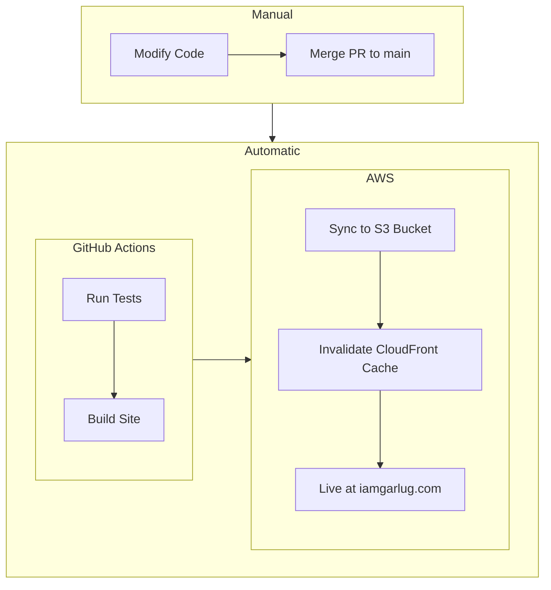

# Stephen Humburg — Portfolio Website

This site is a professional portfolio where you can learn about my background, download my resume,
and find links to my work and professional profiles. I built this site myself using Angular and
Claude Code as a hands-on example of how I leverage modern tools to ship software efficiently.

## Live Site

[https://iamgarlug.com](https://iamgarlug.com)

## Built With

**Production**
- [Angular 21](https://angular.dev/)
- [Angular Material 21](https://material.angular.dev/)
- [TypeScript 5.9.3](https://www.typescriptlang.org/)
- [Mermaid 11.13.0](https://mermaid.js.org/)

**Development**
- [Angular CLI 21.2.2](https://angular.dev/tools/cli)
- [Vitest](https://vitest.dev/) (unit testing)
- [Claude Code](https://claude.ai/code) (AI-assisted development)

## CI/CD

Merging a pull request into `main` automatically triggers the [GitHub action deployment workflow](.github/workflows/deploy.yml), which tests, builds, and deploys the application to AWS.



## Environment Configuration (not committed)

This project uses Angular's environment file pattern. Copy and configure the environment files before building:

```
src/environments/environment.ts        ← development
src/environments/environment.prod.ts   ← production
```

See `src/environments/environment.ts` for the required keys.

## Building

```bash
ng build
```

Build artifacts are stored in the `dist/` directory.

## Running unit tests

```bash
ng test
```

## Development server

To start a local development server, run:

```bash
ng serve
```

Once the server is running, open your browser and navigate to `http://localhost:4200/`.
